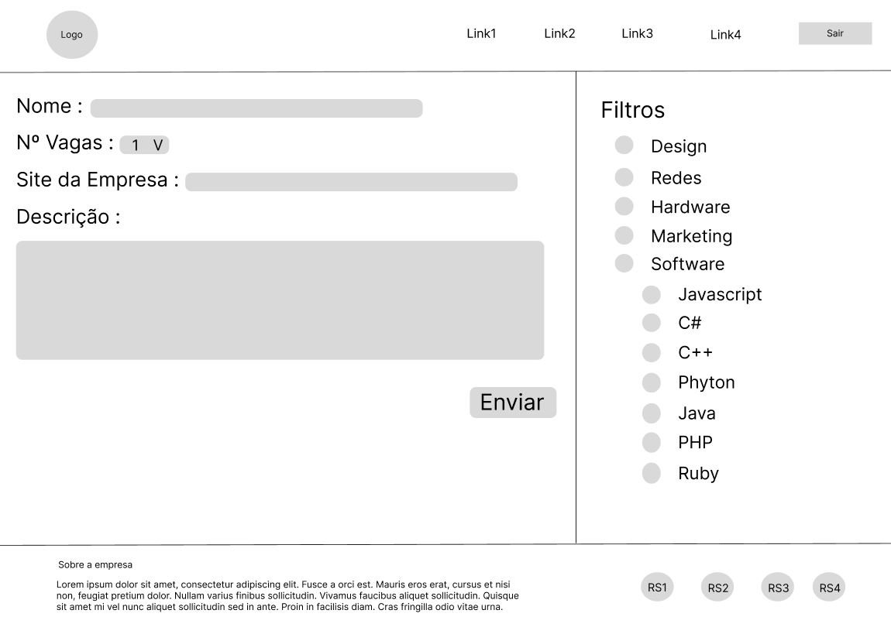

# Projeto de Interface

## User Flow

Visão geral da interação do usuário pelas telas do sistema.

## Wireframes

São protótipos usados em design de interface para sugerir a estrutura de um site web e seu relacionamentos entre suas páginas. Um wireframe web é uma ilustração semelhante do layout de elementos fundamentais na interface.

### Landing page

Esse é o wireframe da primeira tela que as pessoas vão se deparar quando abrirem o site, a página para capturar novos usuários, já que terá uma apresentação da aplicação, um link levando à página de cadastro, além de levar ao login também.

### Perfil da empresa - logado

Esse é o wireframe da tela que irá aparecer para o usuário caso ele logue/cadastre como empresa/empregador. Ele poderá ter sua descrição, avaliações de pessoas que já trabalharam para ele, ver os trabalhos que estão sendo realizados para ele, etc.

### Perfil do freelancer - logado

Esse é o wireframe da tela que irá aparecer para o usuário caso ele logue/cadastre como freelancer. Ele poderá ter sua descrição, avaliações por seus trabalhos anteriores, ver os trabalhos que estão sendo realizados por ele, etc.

### Vagas Disponíveis

Esse é o wireframe da tela que irá aparecer, quando o usuário for procurar por vagas na sua localidade usando a barra de pesquisa. Ele vai possuir alguns filtros predefinidos e descrição detalhada das vagas listadas.

## Página principal - Carrossel

Esse é o wireframe da tela principal, onde será disponibilizado um carrossel interativo que dará ao usuário a opção de cancelar ou aceitar vagas (enviar currículo). Além disso, a pagina também conta com um chat que ira permitir o contato entre empregador e
contratado.

## Página de Login/Cadastro

Esse é o wireframe da tela principal de Login e Cadastro, onde o usuário podera realizar o cadastro ou logar em sua conta.

## Página de Editar Perfil

Esse é o wireframe da tela de editar perfil, com as possibilidades de mudar seus dados, como imagem do perfil, nome do perfil, sobre seus serviços/Tipo de trabalho e descrição dos empregos.

## Página de Criar Vagas

Esse é o wireframe da tela de criar vagas, onde sera disponibilizado criação de vagas, pros perfis empresariais, aonde terá acesso a colocar dados do perfil da vaga como nome, numeros de vagas, site da empresa, descrição e filtros

