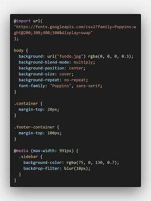

# Template padrão do site

Baseamos nosso guia de acordo com o aplativo de relacionamento Tinder, pois proporciona bastante atenção a sua maneira que funciona a aplicação, com a maneira de negação e aceitação de outros usuários, trazendo uma criatividade diferente, acompanhado com as cores em formato de degradê, demostrando um visual mais variável e atrativo para o usuário.
Isso tudo proporcionado, por uma responsividade que irá diminuindo seu layout, formando um layout mobile, trazendo conteudos da direita pra parte central dos elementos que ficam a esquerda.

## Design

Layout sera baseado em três repartições;

#### Cabeçalho

- Logo, localizada na parte superior esquerdo do cabeçalho;
- Menu de navegação, localizado na parte superior central, com tipografia Poppins;
- Botton, localizado na parte superior direito do cabeçalho com tipografia Poppins e com cor #B03F63;

#### Sessão

- Tipografia poppins, nos Titulos principal, secundario e textos;

#### Rodapé

- Informações da aplicação, localizada na parte inferior esquerdo;
- Tipografia poppins, no Titulo principal e no texto;
- Icones das redes sociais Instagram, X, GitHub e Facebook, localizados na parte inferior direito;

- Cores padrões usadas em degradê para todas as repartições do layout #FDCB1B, #E07B45, #B03F63, #661476, #120079.

## Cores

Paleta de cores que será utilizada:

#### #FDCB1B

#### #E07B45

#### #B03F63

#### #661476

#### #120079

## Tipografia

#### Poppins Medium 500: título da página

#### Poppins Regular 400: título de seção

#### Poppins ExtraLight 200: rótulos de componentes

#### Poppins Light 300: corpo de texto

## Iconografia

## Logo TechMatch

logo da aplicação TechMatch que sera usada nos cabeçalhos das demais telas.

## Icones

Icones que serão usados nossa aplicação nas paginas com footer

### Facebook

Icone irá levar o usuário para a pagina da aplicação no Facebook.

### Instagram

Icone irá levar o usuário para a pagina da aplicação no Instagram.

### X

Icone irá levar o usuário para a pagina da aplicação no X(Twitter).

### GitHub

Icone irá levar o usuário para a pagina do projeto no GitHub.

## Estilos CSS

